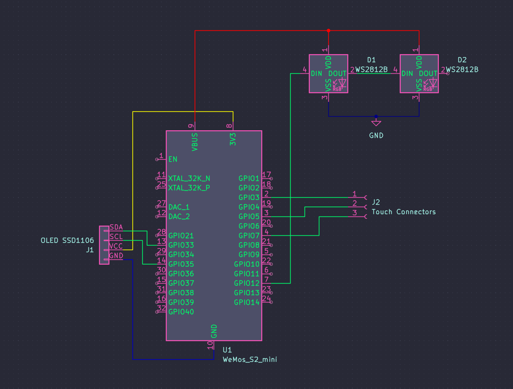

# Pomodoro Timer made with Esp32 and OLED display

The project uses Platform.io with Arduino framework as build environment. Make sure to use latest version. 
Remember to select the correct COM port in `platformio.ini` to before trying to upload the project to the MCU.

# Features
- Timer - start timer and get to work!
- Editor - set timer starting value up to 99 minutes
- Pause - you can stop and resume timer
- Capacitive touch sensors - no buttons, complete silence
- Visual alarm - LEDs will flash once timer hits 00:00
- Touch feedback - LEDs animations provide snappy touch feedback

# Hardware
- [Wemos S2 mini](https://www.wemos.cc/en/latest/s2/s2_mini.html)
- SSD1106 128x64 0.96" display
- 2x LED ARGB WS2812B

Kicad project is available in `esp-pomodoro-clock` directory.

# Software
- Custom software based on Platform.io using Arduino framework

# TODO
- NTP sync with RTC
- Timer presets
- Daily pomodoro target
